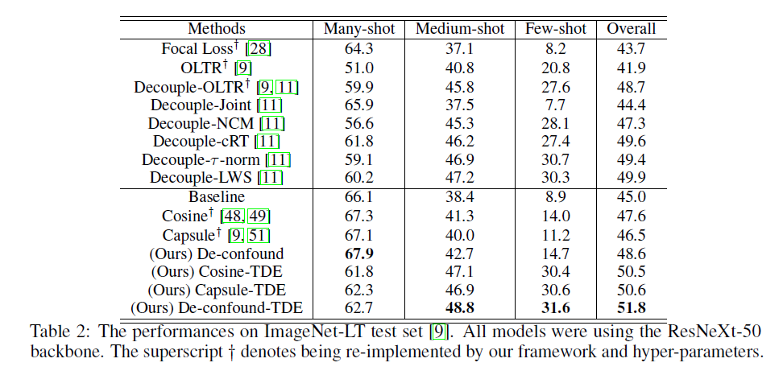
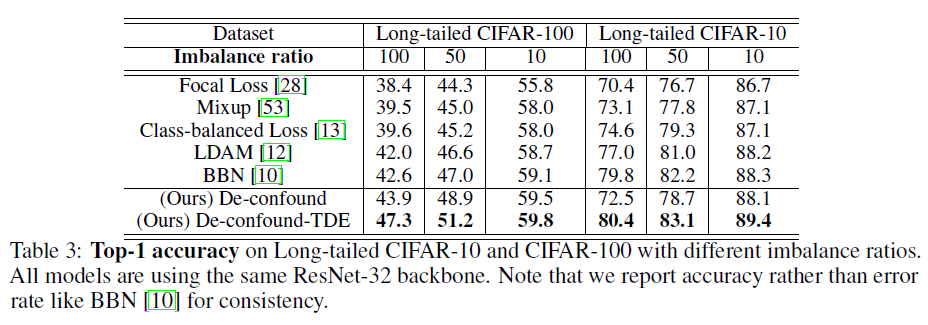

# Long-Tailed image Classification

This project is built on top of [Decoupling](https://github.com/facebookresearch/classifier-balancing). The main body of **[the proposed Causal-TDE](https://kaihuatang.github.io/Files/long-tail.pdf)** is under [./models/CausalNormClassifier.py](models/CausalNormClassifier.py) and [run_networks.py](run_networks.py) 


### Training
For ImageNet_LT: 
```bash
python main.py --cfg ./config/ImageNet_LT/causal_norm.yaml
```

For Long-Tailed CIFAR-10 using ResNet32:
```bash
python main.py --cfg ./config/CIFAR10_LT/causal_norm_32.yaml
```

For Long-Tailed CIFAR-10 using ResNext50:
```bash
python main.py --cfg ./config/CIFAR10_LT/causal_norm.yaml
```

For Long-Tailed CIFAR-100 using ResNet32:
```bash
python main.py --cfg ./config/CIFAR100_LT/causal_norm_32.yaml
```

For Long-Tailed CIFAR-100 using ResNext50:
```bash
python main.py --cfg ./config/CIFAR100_LT/causal_norm.yaml
```

If you want to change any hyper-parameter, you can find them in the corresponding yaml config file. **IMPORTANT: if you just want to change the TDE trade-off parameter alpha, you don't need to re-train the model, you can directly use different alphas during testing, because it's not involved in training. I also have a useful trick to pick up alpha: when you are testing on a dataset without additional val set (or directly testing on val set), you can choose the alpha that makes alpha times cos approximate to 1.0 in average.**.

For Long-Tailed CIFAR-10/-100, if you want to change the imbalance ratio, you can set "cifar_imb_ratio" in the corresponding yaml file, e.g., cifar_imb_ratio=0.01/0.02/0.1 means imbalance ratio = 100, 50, 10 in the paper. To compare our methods with [BBN](https://github.com/Megvii-Nanjing/BBN) using Long-tailed CIFAR-10/-100, we copy their [ResNet32](https://github.com/Megvii-Nanjing/BBN/tree/master/lib/backbone) as your backbone.

### Testing
For ImageNet_LT: 
```bash
python main.py --cfg ./config/ImageNet_LT/causal_norm.yaml --test --model_dir ./logs/ImageNet_LT/models/your_model
```

For Long-Tailed CIFAR-10 using ResNet32:
```bash
python main.py --cfg ./config/CIFAR10_LT/causal_norm_32.yaml --test --model_dir ./logs/ImageNet_LT/models/your_model
```

For Long-Tailed CIFAR-10 using ResNext50:
```bash
python main.py --cfg ./config/CIFAR10_LT/causal_norm.yaml --test --model_dir ./logs/ImageNet_LT/models/your_model
```

For Long-Tailed CIFAR-100 using ResNet32:
```bash
python main.py --cfg ./config/CIFAR100_LT/causal_norm_32.yaml --test --model_dir ./logs/ImageNet_LT/models/your_model
```

For Long-Tailed CIFAR-100 using ResNext50:
```bash
python main.py --cfg ./config/CIFAR100_LT/causal_norm.yaml --test --model_dir ./logs/ImageNet_LT/models/your_model
```

### Results





## Citation
If you find our paper or this project helps your research, please kindly consider citing our paper in your publications.
```bash
@inproceedings{tang2020longtailed,
  title={Long-Tailed Classification by Keeping the Good and Removing the Bad Momentum Causal Effect},
  author={Tang, Kaihua and Huang, Jianqiang and Zhang, Hanwang},
  booktitle= {NeurIPS},
  year={2020}
}
```
