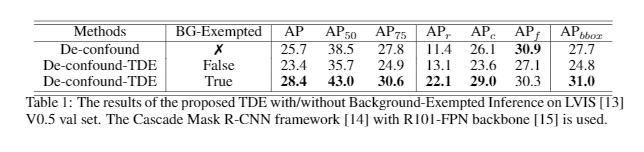
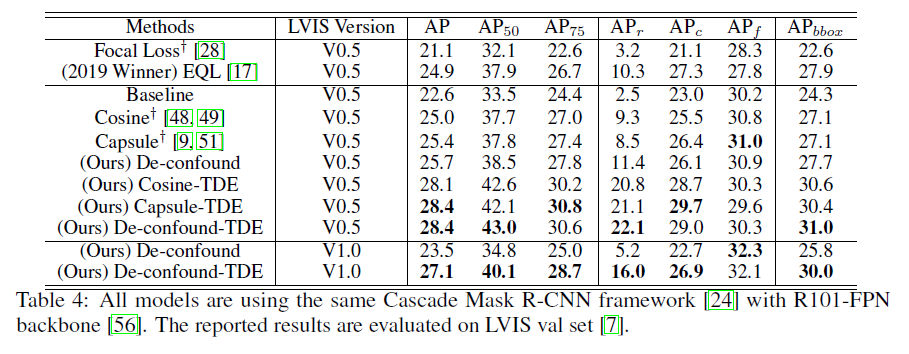

# Long-Tailed Object Detection and Instance Segmentation

This project is built on top of [mmdetection V2.4](https://github.com/open-mmlab/mmdetection). The main body of **[the proposed Causal-TDE](https://kaihuatang.github.io/Files/long-tail.pdf)** is under [./mmdet/models/roi_heads/bbox_heads/convfc_bbox_head.py](mmdet/models/roi_heads/bbox_heads/convfc_bbox_head.py). 

You can check the [documentation](https://mmdetection.readthedocs.io/) for more guidance of using mmdetection, but if you just want to quickly try our method, you can run the following commands.


### Training
```bash
CUDA_VISIBLE_DEVICES=0,1,2,3,4,5,6,7 PORT=112222 bash ./tools/dist_train.sh configs/htc/htc_r101_fpn_20e_causal.py 8 --work-dir work_dirs/htc_r101_fpn_20e_causal --no-validate
```

The hyper-parameters of the proposed TDE are actually in convfc_bbox_head.py rather than the config file. Note that using --no-validate will save lots of time, because LVIS V1.0 has a much larger validation set. **IMPORTANT: if you just want to change the TDE trade-off parameter alpha, you don't need to re-train the model, you can directly use different alphas during testing, because it's not involved in training. A useful trick to pick up alpha: when you are testing on a dataset without additional val set (or directly testing on val set), you can choose the alpha that makes alpha times cos approximate to 1.0 in average.**


### Testing
```bash
CUDA_VISIBLE_DEVICES=0,1,2,3,4,5,6,7 PORT=112222 bash ./tools/dist_test.sh configs/htc/htc_r101_fpn_20e_causal.py work_dirs/htc_r101_fpn_20e_causal/latest.pth 8 --eval bbox segm
```

### Background-Exempted Inference
This is a very useful trick to apply TDE on object detection or instance segmentation. As we discussed in our supplementary materials, In object detection and instance segmentation tasks, the existing frameworks usually need a background category for the classifier to filter the trivial regions, which is also a head class. However, the preference towards the background is not just a good bias but also an essential bias. Otherwise, the results will be full of meaningless trivial bounding boxes or regions. Therefore, we propose a Background-Exempted Inference that freezes the foreground / background probability ratio before and after the TDE for each prediction. The Background-Exempted Inference can be formulated as:


where i = 0 is the background class, p_i = P(Y =i | do(X = x)) is the original probability, and q_i is the softmax activated probability of the TDE(Y_i).

The results with and without Background-Exempted Inference are reported as follows:



As we can see, the Background-Exempted Inference strategy successfully prevents the TDE from hurting the foreground-background selection. It is the key to apply TDE in tasks like object detection and instance segmentation that include one or more legitimately biased head categories, i.e., this strategy allows us to conduct TDE on a selected subset of categories.

### Results



## Citation
If you find our paper or this project helps your research, please kindly consider citing our paper in your publications.
```bash
@inproceedings{tang2020longtailed,
  title={Long-Tailed Classification by Keeping the Good and Removing the Bad Momentum Causal Effect},
  author={Tang, Kaihua and Huang, Jianqiang and Zhang, Hanwang},
  booktitle= {NeurIPS},
  year={2020}
}
```
